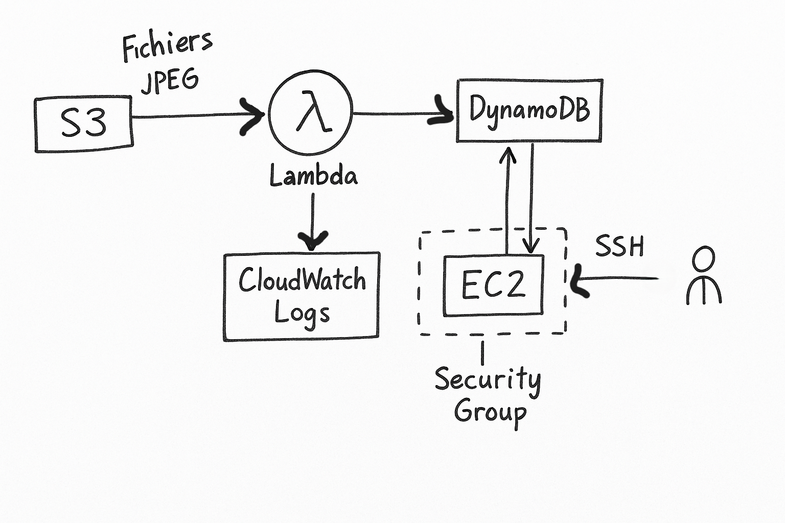

# Projet AWS - Infrastructure CloudFormation Complète

Ce projet met en place une infrastructure cloud sur AWS en utilisant **CloudFormation**, dans le cadre d'un examen. Il comprend la création et l'intégration des services EC2, S3, Lambda, DynamoDB, IAM et CloudWatch.

---

##  Objectif du projet

Déployer automatiquement une infrastructure serveur sans avoir à tout configurer manuellement. Le but est de :

* Collecter des fichiers dans un bucket S3
* Déclencher une fonction Lambda lors de l’ajout de fichier
* Enregistrer les métadonnées dans une table DynamoDB
* Afficher les logs dans CloudWatch
* Disposer d’une instance EC2 sécurisée pour traitement manuel si nécessaire

---

##  Technologies et services utilisés

* **AWS CloudFormation** : Pour le déploiement de l'infrastructure en Infrastructure-as-Code (IaC)
* **S3 (Simple Storage Service)** : Stockage des fichiers
* **Lambda** : Fonction déclenchée à chaque ajout de fichier dans S3
* **DynamoDB** : Base de données NoSQL pour stocker les métadonnées
* **EC2** : Instance pour analyse manuelle et accès SSH sécurisé
* **IAM** : Gestion des rôles et permissions
* **CloudWatch Logs** : Suivi et logs de l'exécution Lambda

---

##  Architecture globale du projet



### Détails du flux :

1. **L'utilisateur** ajoute un fichier dans le bucket **S3**.
2. Cela déclenche automatiquement la fonction **Lambda**.
3. **Lambda** lit les données et insère les métadonnées dans **DynamoDB**.
4. Tous les logs sont envoyés à **CloudWatch Logs**.
5. Une instance **EC2** est déployée pour analyses avancées, avec accès SSH sécurisé à l’utilisateur.

---

##  Contenu du dépôt Git

| Fichier / Dossier             | Description                           |
| ----------------------------- | ------------------------------------- |
| `template_DV.yaml`            | Template CloudFormation complet       |
| `README.md`                   | Fichier de documentation (ce fichier) |
| `schema_infrastructure.png` | Schéma de l’architecture du projet    |

---

##  Détail du template `template_DV.yaml`

###  Paramètres personnalisables

```yaml
Parameters:
  EnvName:                # Exemple: dev, staging, prod
  VPcId:                  # ID de la VPC existante
```

###  Groupe de sécurité (Security Group)

* Autorise uniquement le **port 22 (SSH)**
* Restreint à une adresse IP spécifique (ex : `196.169.11.120/24`)

###  EC2 Instance

* AMI Ubuntu : `ami-0160e8d70ebc43ee1`
* Type : `t2.micro`
* Ajout de **2 volumes EBS**
* Utilisation de **tags** pour identification

###  Table DynamoDB

* Nom : `FileMetadata-<EnvName>`
* Clé primaire : `FileName` (type `String`)
* Capacité : 5 RCUs, 5 WCUs (mode provisionné)

###  Fonction Lambda

* Runtime : `Python 3.12`
* Gère les événements S3
* Insère les infos dans DynamoDB
* Extrait :

```python
s3 = boto3.client('s3')
dynamodb = boto3.resource('dynamodb')
...
table.put_item(Item={'FileName': key, 'BucketName': bucket})
```

###  Bucket S3

* Nom : `<EnvName>-file-metadata-bucket`
* Événement `s3:ObjectCreated:*`
* Déclenchement de Lambda

###  Permission Lambda

* Autorisation explicite pour que S3 appelle Lambda via `AWS::Lambda::Permission`

---

##  Déploiement du Stack

### Pré-requis :

* Disposer d’un compte AWS avec les droits nécessaires
* Connaitre l’ID de la VPC et de la subnet

### Via AWS Console

1. Aller sur CloudFormation → Create Stack → With new resources
2. Importer `template_DV.yaml`
3. Renseigner les paramètres : `EnvName` et `VPcId`
4. Lancer le déploiement

### Via AWS CLI *(optionnel)*

```bash
aws cloudformation deploy \
  --template-file template_DV.yaml \
  --stack-name projet-aws-stack \
  --capabilities CAPABILITY_NAMED_IAM \
  --parameter-overrides EnvName=dev VPcId=vpc-xxxxxx
```

---

##  Résultat attendu

* Une infrastructure 100% déployée automatiquement
* Une instance EC2 accessible uniquement via SSH
* Une fonction Lambda fonctionnelle
* Un bucket S3 connecté à Lambda
* Une table DynamoDB contenant les noms des fichiers ajoutés

---

##  Exportation de ce fichier

* En Markdown : `README.md`
* En PDF : Export possible depuis GitHub avec une extension navigateur (ou via VSCode + extension Markdown PDF)

---

## Auteur

Alix – Data Analyst
Projet réalisé dans le cadre d’un **examen AWS - Mai 2025**
